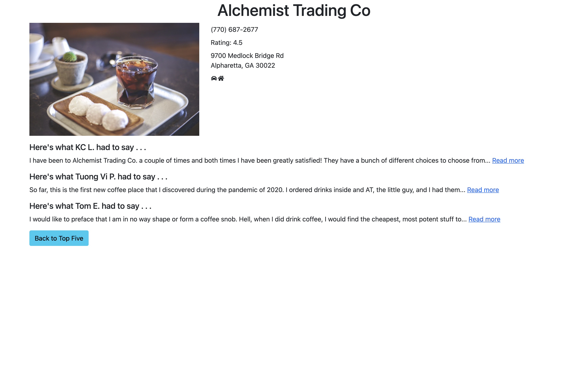

# alpharetta-ice-cream

## About

Alpharetta Ice Cream is a no-nonsense app that gives you the top five ice cream locations for Alpharetta based on the Yelp Fusion API ratings. It allows users to:

- See featured images
- Find contact information
- View at a glance, pickup and delivery availability
- Dive in and read review snippets about each location.




## Installation

1. Clone the repo
2. Ensure you have node 12 or later installed.
3. Ensure you have MongoDB server running either as a service or via `mongod`
4. Run `npm install` in the root (this will automatically install both server and client dependencies)
5. Create a `.env` file in your root with the following values:

```text
YELP_CLIENT_ID=YourYelpClientId
YELP_API_KEY=YourYelpFusionApiKey
```

## Running the App

1. To start the app, run `npm start`
2. Your browser should open automatically, otherwise, navigate to [http://localhost:3000](http://localhost:3000)
